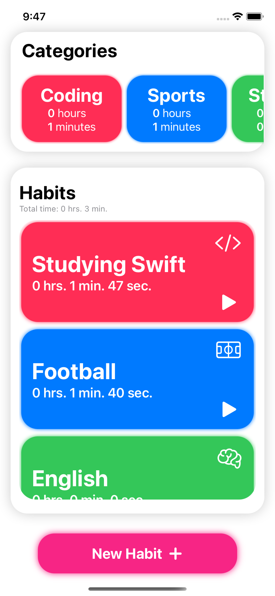
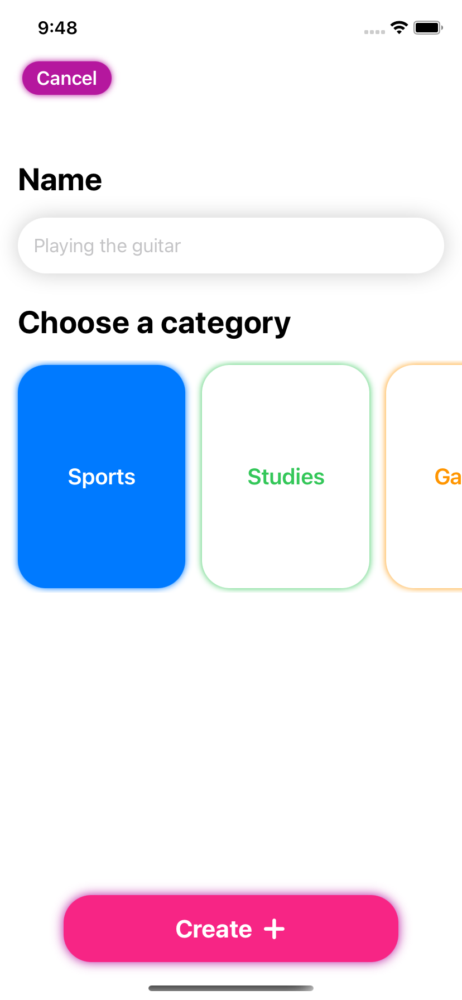

# Habitz 📚
Habitz is a SwiftUI app designed to help keeping track of your daily habits. It also ranks the habits by frecuency, and stores them in your local files.

## Screenshots & Demo

| Home | New Habit | Demo
| --- | --- | --- |
|  |  |  |
